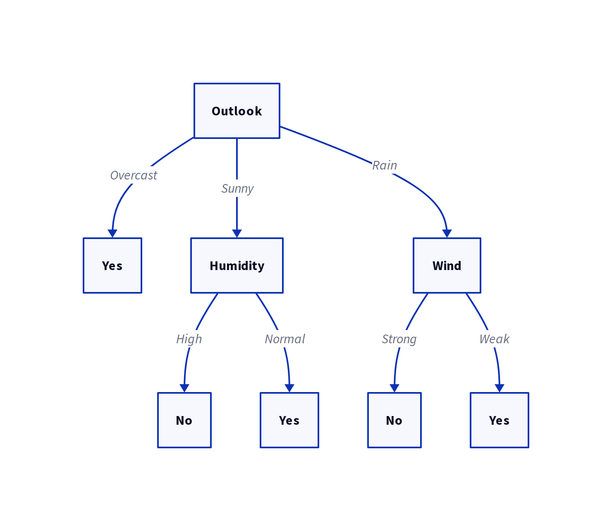

# Lez.2 - Decision Trees

An hypothesis T is tree $T = (V, E)$ where $\forall v \in V$, v is either an Attribute or a target label (YES or NO ...).

The tree is built by looking at which attribute causes the Entropy of the associated cases to drop. Entropy is the measure of disorder, an high entropy means tha the sub dataset of a node is perfectly balanced. You can derive the meaning of entropy zero by your self.

## Entropy

The formula for entropy for an attribute A or in general for a subset of dataset instances is the following (assuming target $t \in T$):

- called $n = |\{ x | x.t = t \}|$
- called k = $\frac n {|D|}$
- $E(D) = - \Sigma_{t \in T} \; k \; log_2(k)$

  For binary classification this is further reduced to saying:
  - called $p$ the number of positive ($T = 1$) instances
  - called $n$ the number of negative ($T = 0$) instances
  - called $k_p = \frac p {p + n}$
  - called $k_n = \frac n {p + n}$
  - $E(D) = - k_p \; log_2(k_p) - k_n \; log_2(k_n)$

 Before introducing Information Gain, one should talk before of a function called the $remainder$.

## Remainder

This is the weighted sum of entropy of sub expressions. Taken into our context, this is to say that the choice of filtering a dataset by an attribute value gives us another dataset with a proper Entropy. What we're aiming is to measure the entropy of the divided system, and the weighted sum of entropies is exactly that.

More formaly, the remainder of $D$ respect of $A$ is:

- called $m = |\{ x | x.a = a \}|$
- called w = $\frac n {|D|}$
$R(D, A) = \Sigma_{a \in A} \; w \cdot E(D | A = a)$

## Information Gain

Now that the concept of Remainder is given, is trivial to understand why this formula is built this way. The IG is simply the difference between the current entropy and the complessive entropy after the partition of the dataset $D$ with the values of $A$.

$IG(D, A) = E(D) - R(D, A)$

## Building the Tree

The ID3 algorithm is as simple as trivial, everytime you need to choose how to partition the dataset you'll use $IG$ rank to decide which partition gives you the simplest structure of the tree. Occam's razor, again.

Refer to [this page for the ID3 algorithm](./algos.md)